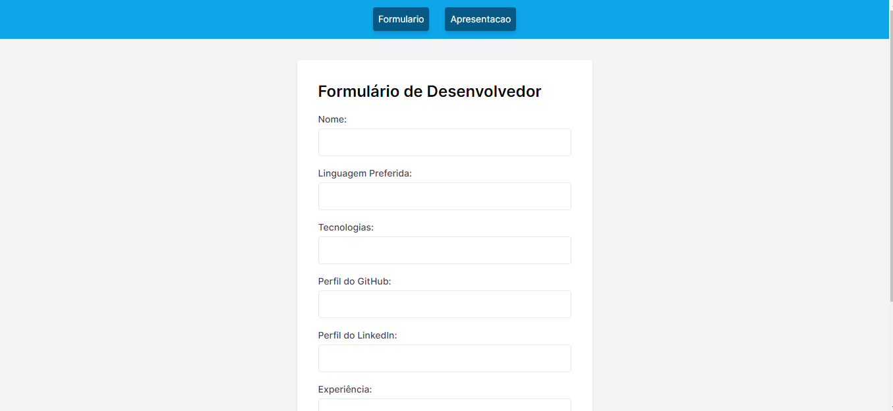
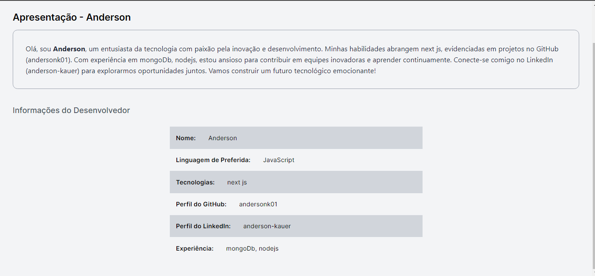

# Context em React: Exemplo de Utilização

Neste repositório, vou compartilhar um exemplo prático de como utilizar o hook `useContext` em React para criar uma apresentação de desenvolvedor dinâmica. O `useContext` é uma ferramenta poderosa que nos permite compartilhar e acessar dados entre componentes sem a necessidade de passar props manualmente através da árvore de componentes.

## O que é useContext?

O hook `useContext` é parte da biblioteca de React Hooks e é utilizado para acessar o contexto de um componente. Ele é especialmente útil em situações em que você deseja evitar "prop drilling" (passagem de props através de vários componentes) e compartilhar dados que são relevantes para vários componentes em diferentes níveis da hierarquia.

## Exemplo de Utilização

Neste exemplo, criei um componente de apresentação de desenvolvedor que exibe informações sobre um desenvolvedor com base em um contexto. O contexto é criado utilizando o `useContext`, permitindo que as informações do desenvolvedor sejam acessadas em vários componentes sem precisar serem passadas como props.

O código demonstrado aqui utiliza o `useContext` para acessar os dados do contexto e renderizar uma apresentação dinâmica de desenvolvedor. A apresentação inclui detalhes como nome, linguagem preferida, tecnologias, perfil do GitHub, perfil do LinkedIn e experiência.

Ao utilizar o `useContext`, o código se torna mais limpo e mais eficiente, uma vez que evita a propagação manual de props entre vários componentes intermediários.

## Como Rodar o Exemplo

Para testar este exemplo em sua máquina, você pode clonar este repositório e executar o aplicativo React. Certifique-se de ter o Node.js e o npm instalados.

Espero que este exemplo prático de utilização do `useContext` seja útil para entender como aproveitar o poder dos contextos no React. Sinta-se à vontade para explorar o código e experimentar outras maneiras de utilizá-lo em suas aplicações.
